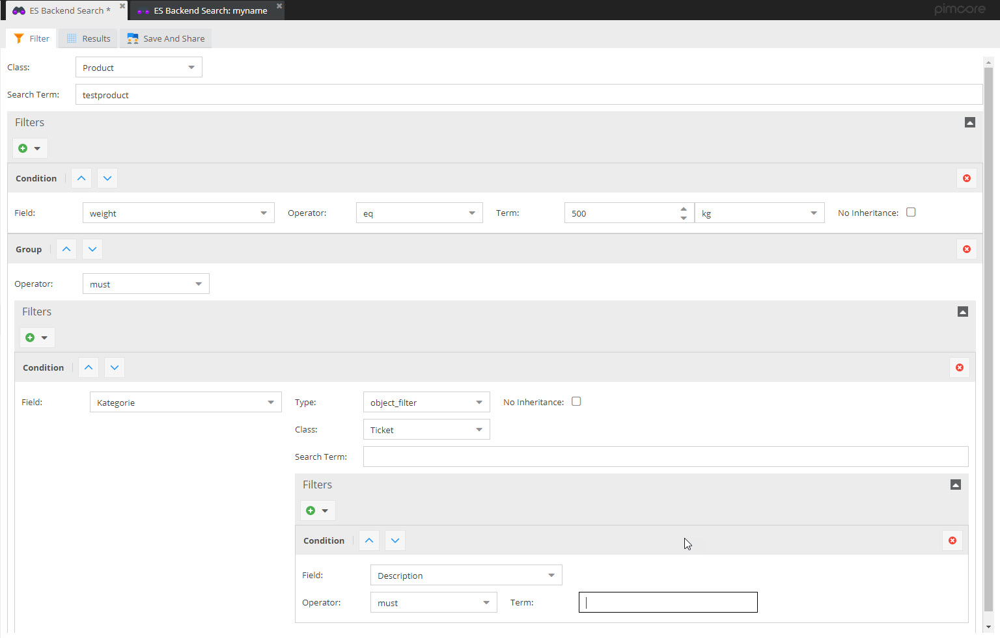

# OpenDXP Advanced Object Search via OpenSearch or Elasticsearch

Advanced Object Search bundle provides advanced object search in 
OpenDXP backend powered by search index technology (OpenSearch or Elasticsearch). 

***

## Disclaimer

> OpenDXP is a community-driven fork based on the Pimcore® Community Edition (GPLv3).  
> OpenDXP is independent and maintained by its community and contributors.
> It is not affiliated with, endorsed by, or sponsored by Pimcore GmbH.   
> Original credits: [Pimcore GmbH](https://www.pimcore.com)

**OpenDXP Admin Bundle is based on the Pimcore® Community Edition and remains licensed under GPLv3.**

***

## Integration into OpenDXP

### Installation and Configuration
Follow [Installation instructions](./doc/00_Installation.md).

#### Configure Search Client 
Setup search client configuration in your Symfony configuration files (e.g. `config.yaml`).
See [OpenSearch Client Setup](./doc/04_Opensearch.md) or [Elasticsearch Client Setup](./doc/05_Elasticsearch.md) for more information.

#### Configure Advanced Object Search
Before starting, setup at least following configuration in symfony configuration tree: 

```yml
opendxp_advanced_object_search:
    # Prefix for index names
    index_name_prefix: 'advanced_object_search_'
```

For further configuration options follow the docs and the inline description of the configuration tree. 

#### Initial Indexing
Call OpenDXP command `advanced-object-search:update-mapping` for creating mappings and `advanced-object-search:re-index` 
for indexing data for the first time. 


### GUI
GUI for creating searches against search index with
- saving functionality
- sharing functionality




### Plugin Hooks
Following event listeners are called automatically
- `opendxp.dataobject.postUpdate` - data object is updated in search index, all child objects are added to update queue.
- `opendxp.dataobject.preDelete`  - data object is deleted from search index.
- `opendxp.class.postUpdate`  - search index mapping is updated or index recreated if necessary.

### OpenDXP Console
Functions in OpenDXP console.
- `advanced-object-search:process-update-queue` --> processes whole update queue of search index.
- `advanced-object-search:re-index` --> Reindex all data objects of given class. Does not delete index first or resets update queue.
- `advanced-object-search:update-mapping` --> Deletes and recreates mapping of given classes. Resets update queue for given class.

For details see documentation directly in OpenDXP console.


### OpenDXP Maintenance & Symfony Messenger
By default, with every OpenDXP maintenance call, 500 entries of update queue are processed.
As an alternative, you also can activate symfony messenger to process the update queue. For that,
just activate it as follows.

```yml 
 opendxp_advanced_object_search:
    messenger_queue_processing:
        activated: true
 ```

If activated, the processing is kicked off automatically with the `advancedobjectsearch_update_queue` maintenance task.

Messages are dispatched via `opendxp_index_queues` transport. So make sure, you have
workers processing this transport when activating the messenger based queue processing. 


## API Methods

### Create Mapping for data object classes

Per data object class one index with one document type is created.
```php
<?php
/**
* @var \OpenDxp\Bundle\AdvancedObjectSearchBundle\Service $service
 */
$service = $this->get("OpenDxp\Bundle\AdvancedObjectSearchBundle\Service");
$service->updateMapping(ClassDefinition::getByName("Product"));
```


### Update index data

On data object save or via script:
```php
<?php
/**
* @var \OpenDxp\Bundle\AdvancedObjectSearchBundle\Service $service
 */
$service = $this->get("OpenDxp\Bundle\AdvancedObjectSearchBundle\Service");

$objects = Product::getList();
foreach($objects as $object) {
    $service->doUpdateIndexData($object);
}

```

### Search/Filter for data

```php
<?php
/**
* @var \OpenDxp\Bundle\AdvancedObjectSearchBundle\Service $service
 */
$service = $this->get("OpenDxp\Bundle\AdvancedObjectSearchBundle\Service");

//filter for relations via ID
$results = $service->doFilter(3,
    [
        new FilterEntry(
            "objects",
            [
                "type" => "object",
                "id" => 75
            ],
            BoolQuery::SHOULD
        )
    ],
    ""
);


//filter for relations via sub query
$results = $service->doFilter(3,
    [
        [
            "fieldname" => "objects",
            "filterEntryData" => [
                "type" => "object",
                "className" => "Customer",
                "filters" => [
                    [
                        "fieldname" => "firstname",
                        "filterEntryData" => "tom"
                    ]
                ]
            ]
        ],

    ],
    ""
);


// full text search query without filters
$results = $service->doFilter(3,
    [],
    "sony"
);


// filter for several attributes - e.g. number field, input, localized fields
$results = $service->doFilter(3,
    [
        [
            "fieldname" => "price",
            "filterEntryData" => 50.77
        ],
        [
            "fieldname" => "price2",
            "filterEntryData" => [
                "gte" => 50.77,
                "lte" => 50.77
            ]
        ],
        [
            "fieldname" => "keywords",
            "filterEntryData" => "test2",
            "operator" => BoolQuery::SHOULD
        ],
        [
            "fieldname" => "localizedfields",
            "filterEntryData" => [
                "en" => [
                    "fieldname" => "locname",
                    "filterEntryData" => "englname"
                ]
            ]
        ],
        [
            "fieldname" => "localizedfields",
            "filterEntryData" => [
                "de" => [
                    "fieldname" => "locname",
                    "filterEntryData" => "deutname"                
                ]
            ]
        ],
        new FilterEntry("keywords", "testx", BoolQuery::SHOULD)
    ],
    ""
);

```


## Not Supported Data Types
Currently following data types are not supported - but can be added if needed in future versions: 
- ClassificationStore
- Slider
- Password
- Block
- Table
- StructuredTable
- Geographic data types
- Image data types


## Integrate new Data Type

- Implement Field Definition Adapter by implementing the `IFieldDefinitionAdapter` interface. 
- Register new Field Definition Adapter as service
- Add mapping in configuration like 
```yml
opendxp_advanced_object_search: 
    field_definition_adapters:
        newDataTypeName: SERVICE_ID_OF_FIELD_DEFINITION_ADAPTER
``` 

## Extend Filters in the Result Tab

If you want custom filters in the result tab directly without having to create a new advanced object search every time
read [here on how to extend the result tab with custom filters](./doc/01_Extending_Filters.md).

***

## Upstream Origin & Version Transparency
This project is a fork of the [Pimcore advanced-object-search (5ffde33 / v6.1.1)](https://github.com/pimcore/advanced-object-search/tree/5ffde330f2963b6643b73fd31edc04511502c8b0), which is © Pimcore GmbH and licensed under GPLv3.

## License
Licensed under the GNU General Public License v3.0 (GPLv3). For details, please see [LICENSE.md](LICENSE.md).

## Copyright
© Pimcore GmbH  
© 2025 OpenDXP Contributors — GPLv3

## Trademarks
Pimcore® is a registered [trademark](https://www.trademarkelite.com/europe/trademark/trademark-detail/009309841/PIMCORE) of Pimcore GmbH.
Any use of the Pimcore® mark in this repository is purely descriptive to identify the original upstream project.

***

## Contact
For inquiries, suggestions, or contributions, feel free to reach us at contact@opendxp.io.

## About
OpenDXP is a community-driven project initiated by [DACHCOM.DIGITAL](https://www.dachcom.com/de-ch) (Rheineck, Switzerland) and maintained by its community and contributors.
OpenDXP is independent and not affiliated with Pimcore GmbH.

The project’s purpose is to preserve and maintain a GPLv3‑licensed codebase for community use.

It is **not positioned as a competitor** to products or services of Pimcore GmbH and does **not** purport to replace or supersede any Pimcore offering.   
